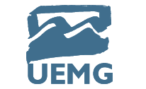

  
  
  
  ## Software de Atividades Complementares da Universidade do Estado de Minas Gerais (UEMG)

  ### Geral
  Este é o software de **_Atividades Complementares (ACG)_** da UEMG - Passos, desenvolvido como trabalho de finalização da disciplina de Programação I. Este software foi desenvolvido com a linguagem de programação C#, com .NET Framework, e conta com funcionalidades de cadastrar alunos, professores, atividades, envio de atividades, aprovação de envio, relatório de atividades enviadas, autenticação e alteração das credenciais de acesso. O desenvolvimento deste software trouxe conhecimentos a respeito da linguagem, da organização de projetos, boas práticas de codificação e banco de dados SQL.
  
  ### Autores
  Este software foi desenvolvido por **[Henrique Menezes Oliveira](https://github.com/menezesho)** e **[Mateus Redivo](https://github.com/Mateus-Redivo)** em parceria com a **[UEMG](https://www.uemg.br/)**.

